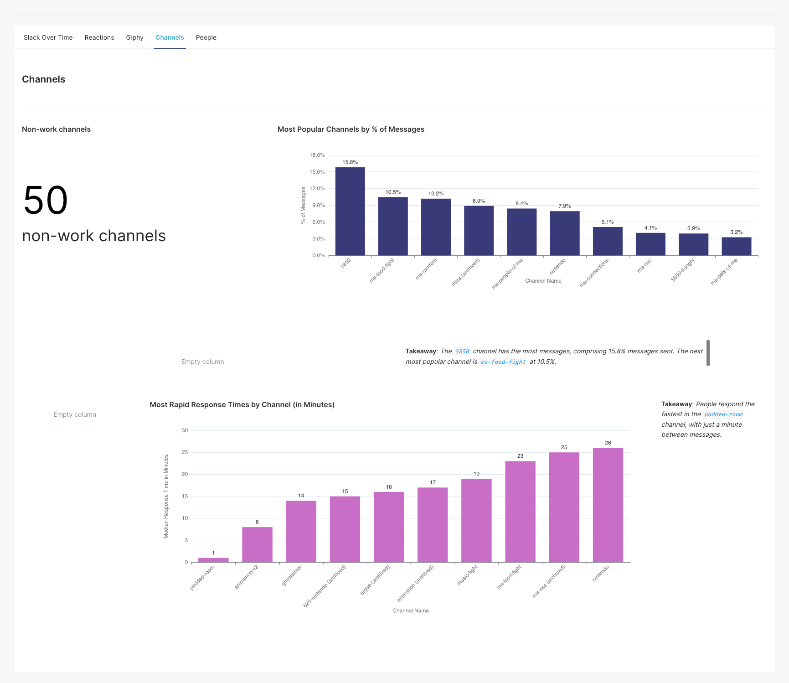

# slacknalysis

Slackanalysis is a personal project that scrapes and analyzes social Slack data, compiling statistics on questions such as:

- Who sends the most messages?
- Who sends the longest messages?
- Which messages generated the most replies and reactions?
- Who is the most likely to use a particular reaction?
- Which reactions does a person use most?

With such a robust community on Slack, I decided to learn Superset to drill down on people's communication behaviors.  This is an old project, dating back to 2020.  *Data is non-sensitive and was downloaded and analyzed with explicit permission as a hobby project.*

### Scraping data
First, a caveat: While Superset is still functional, I believe the `slacker` libray is no longer compatible with Slack, so none of these steps will work anymore :(  Also, the Slack instance I used no longer exists.  Soooo these instructions won't work.  But let's pretend nothing is deprecated!

To scrape Slack data, you'll need to have the following scopes enabled on Slack:
- channels:history
- channels:read
- emoji:read
- reactions:read
- users:read

You will also need to get a Slack verification token and set the `VERIFICATION_TOKEN` environment variable.

Next, you can run docker-compose:
```
docker-compose up --build
```

What's happening here, you ask?

Firstly, a Postgres container is spun up.  It invokes `slack/slack_scraper/migrations/alembic/db-init.sh`, which sets up the database and sets up views defined in `slack/slack_scraper/views`.

Secondly, a dependent Python container is spun up that invokes `slack/slack_scraper/migrations/alembic/db-migrate.sh`.  This runs a database migration and polls Slack for data, using `python -m slack_scraper.populate_db`.  This queries Slack for data and inserts it into the database using SQLAlchemy.

Thirdly, another Postgres container is spun up for Superset.

Fourthly, a container for Superset is set up!  Now you can make charts with Slack data by going to http://localhost:8088.

This was kind of a hack job for fun and never intended for production, so docker-compose just mounts a volume to store any and all Postgres data (both Slack and Superset).  Without the volume mounting, the data would all be ephemeral with the container.

### Analysis
Since this can't be run easily by anyone else at this point, here are dashboards created using this data.  People's names are anonymized.

Time Analysis


Channel Analysis


GIF Analysis


Reaction Analysis


User Analysis


Superset can be a bit tricky to work with insofar as formatting goes, so you can blame any "hm, that doesn't look great" on Superset :-)  Not pictured are filters to drill down on specific channels and users.


### Areas of Improvement
This was very much a fun hobby project and not meant for production purposes, and I was still fairly new to Docker at the time of designing this.  Some areas of improvement:
- Tests!  There are none
- Views should be created *after* the migration is completed
- Postgres containers aren't great because they're ephemeral.  We sidestepped that here by mounting a volume and persisting data to a local computer, but ideally we could have pointed it to a real, persisting database.
- Hosting Superset somewhere, and scheduling the Slack scraping on a regular cadence to keep up with data
- Adding a time filter to the Superset dashboards